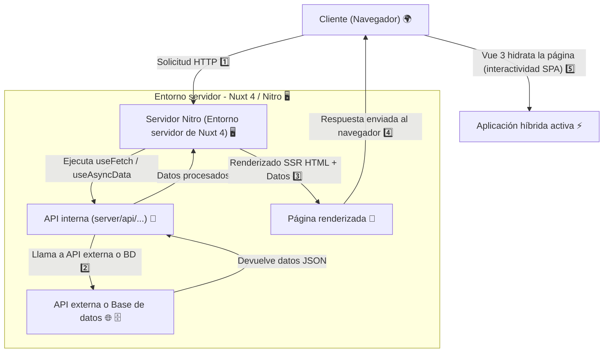

# UT08 Aplicaciones web híbridas: NUXT

> **En este tema trabajaremos los siguientes RAs:**
> RA9. Desarrolla aplicaciones Web híbridas seleccionando y utilizando tecnologías, frameworks servidor y repositorios heterogéneos de información.

## 1. Introducción: ¿Qué es una aplicación web híbrida?

Una **aplicación web híbrida** es aquella que combina características de las **aplicaciones web tradicionales** (que se ejecutan principalmente en el navegador y se desarrollan con tecnologías como HTML, CSS y JavaScript) con características de las **aplicaciones nativas** (que pueden instalarse y ejecutarse directamente en dispositivos móviles o aprovechar funcionalidades del servidor).

En el contexto del **desarrollo web en entorno servidor**, una aplicación híbrida:

* Se ejecuta parcialmente en el **servidor**, donde se procesan datos, se gestionan repositorios y se generan vistas dinámicas.
* Y parcialmente en el **cliente**, donde se aprovechan frameworks modernos (como **Nuxt 4**, **Next.js** o **SvelteKit**) que permiten ejecutar código tanto en el servidor (SSR) como en el cliente (SPA).

Estas aplicaciones **recuperan y procesan información desde múltiples orígenes** (APIs REST, bases de datos, servicios externos, etc.) y utilizan **librerías de terceros** para integrar funcionalidades específicas (autenticación, análisis de datos, inteligencia de negocio, mapas, etc.).

En resumen, son híbridas porque:

* Combinan **tecnologías de servidor y cliente**.
* Integran **fuentes de datos heterogéneas**.
* Aprovechan **código reutilizable** proveniente de librerías y repositorios externos.
* Permiten **desplegar la misma base de código** en diferentes entornos (web, móvil, escritorio).

### 1.2. Ventajas de las aplicaciones híbridas 

El desarrollo híbrido promueve la **reutilización del código** y el **aprovechamiento de información ya existente**, lo que conlleva ventajas clave:

* **Eficiencia y rapidez en el desarrollo:** se pueden reutilizar módulos o componentes ya probados y mantenidos por la comunidad.
* **Compatibilidad multiplataforma:** el mismo desarrollo puede adaptarse a diferentes entornos sin duplicar esfuerzos.
* **Actualizaciones centralizadas:** al apoyarse en tecnologías web, las mejoras se aplican automáticamente al servidor y al cliente.
* **Integración de fuentes externas:** uso de APIs públicas (por ejemplo, OpenWeatherMap, Google Maps, o GitHub) para enriquecer la aplicación.
* **Mejor mantenimiento y escalabilidad:** las librerías y frameworks modernos facilitan la modularidad y la evolución del proyecto.

### 1.3. Tecnologías y frameworks aplicables 

Para crear aplicaciones web híbridas, se utilizan frameworks que soportan **Server-Side Rendering (SSR)** y **Static Site Generation (SSG)**, además de permitir ejecución en el cliente (SPA):

* **Nuxt 4 (Vue 3):** framework híbrido para aplicaciones universales (server + client).
* **Next.js (React):** equivalente en el ecosistema React.
* **SvelteKit:** framework moderno orientado a rendimiento y SSR.
* **Angular Universal:** permite el renderizado en servidor con Angular.

Otros recursos clave:

* **APIs REST y GraphQL** para la comunicación con fuentes externas.
* **Librerías de terceros** como Axios, D3.js, Chart.js, Leaflet, TensorFlow.js, etc.
* **Bases de datos híbridas** y servicios externos como Firebase, Supabase o MongoDB Atlas.

### **4. Creación e integración de repositorios de información (CE9_3 y CE9_4)**

Una aplicación híbrida se caracteriza por **interactuar con repositorios de información existentes** y **crear sus propios repositorios derivados**.

Ejemplo:

* Recuperar datos de una **API pública** (por ejemplo, precios de criptomonedas o datos meteorológicos).
* Procesar esa información en el **servidor** (por ejemplo, filtrando o agregando datos).
* Almacenar los resultados en un **repositorio local o base de datos** (PostgreSQL, MongoDB…).
* Ofrecer una **API interna** para que otros servicios o usuarios consuman los nuevos datos generados.

---

### **5. Uso de librerías de código para funcionalidades específicas (CE9_5)**

El uso de **librerías** es esencial en el desarrollo híbrido. Estas librerías amplían las capacidades de la aplicación sin tener que desarrollar todo desde cero:

* **Autenticación y seguridad:** JWT, Passport, Auth.js.
* **Visualización de datos:** Chart.js, ECharts, D3.js.
* **Mapas y geolocalización:** Leaflet, Mapbox.
* **Machine Learning e inteligencia de negocio:** TensorFlow.js, ML5.js.
* **Gestión de estado y composición:** Pinia, Vuex, Redux Toolkit.

---

### **6. Programación basada en código e información de terceros (CE9_6)**

Las aplicaciones híbridas se apoyan en **ecosistemas abiertos de software**:

* Se integran **servicios web** (APIs de terceros).
* Se aprovecha **código publicado** en plataformas como GitHub, npm o PyPI.
* Se adaptan **plantillas o componentes** que forman parte de frameworks de código abierto.

Esto permite centrarse en el valor añadido del proyecto, reduciendo el tiempo de desarrollo y fomentando la interoperabilidad.

---

### **7. Inteligencia de datos y Big Data (CE9_7)**

En este ámbito, las librerías orientadas a la **inteligencia de negocios (BI)** y **Big Data** permiten que las aplicaciones híbridas analicen datos de diferentes fuentes y generen conocimiento:

* **Librerías de análisis y visualización:** D3.js, Plotly, Chart.js.
* **Conectores de datos heterogéneos:** APIs REST, CSV, JSON, bases SQL/NoSQL.
* **Análisis predictivo o dashboards:** integración con servicios como Google Analytics, Power BI, o Apache Superset.

Estas herramientas amplían la funcionalidad de la aplicación, transformándola en una plataforma capaz de **procesar, analizar y representar datos en tiempo real**.

---

### **8. Prueba, depuración y documentación (CE9_8)**

El proceso final de desarrollo incluye:

* **Pruebas unitarias y de integración** (con Jest, Vitest o Cypress).
* **Depuración** mediante herramientas del navegador y consola del servidor.
* **Documentación técnica y de usuario**, que describa:

  * Arquitectura del sistema.
  * Dependencias y librerías utilizadas.
  * APIs consultadas.
  * Estructura de carpetas y módulos.

## Web Scrapping
::: note
Recuperado de [Manu Perez Alonso](https://manu-perez-alfonso.github.io/modulos/01-Servidor/ud11/#evaluacion)
:::

Internet representa una vasta y valiosa fuente de datos en numerosas áreas de interés. Existen diferentes posibilidades a través de las cuales recolectar datos a través de Internet:

* Juegos de datos ya existentes:

  * Públicos: existen numerosos conjuntos de datos ya preparados para entrenar diferentes algoritmos de Inteligencia Artificial. Puedes encontrar algunos de estos ejemplos en este enlace.
  * Compra de juegos de datos: en numerosas plataformas es posible comprar juegos de datos sobre diversas temáticas: consumo, medioambiente, política... Un ejemplo lo puedes encontrar en este enlace.
  * Datos corporativos: son los datos transaccionales o agregados, generados por la propia actividad privada de una empresa u organización.

* Creación de juegos de datos:
  * Generación de datos: mediante la creación de encuestas, o la utilización de servicios como AmazonTurk, que permiten contratar personal para tareas como etiquetado de datos y clasificación.
  * Recolección de datos existentes: mediante servicios API REST.
  
En la unidad anterior vimos cómo recuperar datos de diversas API REST, diseñadas para tal efecto, pero, ¿qué ocurre si existen sitios web que no proporcionen un servicio web similar?

Para estos casos se puede utilizar Web Scraping, que se trata de una técnica consistente en extraer datos del código HTML de los sitios web. Antes de aplicar esta técnica a un sitio web, es necesario tener en consideración determinados factores:

Legales

¿Se incumple algún reglamento nacional/regional?
¿Se incumplen los "Términos y condiciones" del sitio web?
¿Se está accediendo a lugares no autorizados?
¿Es legal el uso que se le dará a los datos?
Éticos

Robots.txt: es un fichero con información para que los motores de búsqueda no indexen determinadas páginas de un sitio web. Para acceder a este fichero, se añade "/robots.txt" al final de un determinado dominio, de la forma "dominio.com/robots.txt". Aquí se detallan aspectos como si se permite/deniega acceso total o parcial, frecuencia de consultas (crawl-delay), el sitemap (para facilitar la navegación por el sitio), etc. Para más información, consulta este enlace. No respetar las normas establecidas en este fichero puede acarrear consecuencias legales.
En caso de dudas sobre si se puede aplicar esta técnica a un determinado sitio web, el mejor consejo es contactar con la empresa/organización y preguntar.

Tipos de sitios web¶
Existen diferentes casuísticas que nos podemos encontrar cuando tratamos de aplicar Web Scraping en un sitio web, dependiendo del paradigma en que esté basado el sitio web en cuestión:

HTML pre-renderizado o sitios web estáticos: se trata de sitios web cuyo código HTML se envía desde el servidor (backend), ya sea porque se trata de un sitio web estático, porque se utilizan frameworks con sistemas de plantillas (Laravel, CodeIgniter, Django...) que embeben código de servidor en HTML, o también porque se utiliza la técnica de SSR en aplicaciones web reactivas (Vue, React, Angular...). En este caso el HTML se obtiene al hacer una petición HTTP, y se pueden utilizar librerías como BeautifulSoup4 o Scrapy.

Single Page Application (SPA): consiste en un fichero HTML simple con código JavaScript asociado. Durante la navegación, el navegador web ejecuta el código JavaScript y modifica dinámicamente el código HTML para liberar al servidor de esta tarea. Los datos se descargan mediante peticiones HTTP a servicios REST que residen en el servidor, actualizándose solo la parte del HTML que se necesita, sin originar un refresco de toda la página web. Al hacer una petición HTTP, lo que se obtiene es el HTML simple y no los datos que se visualizan en pantalla (ya que es el código JavaScript, en el lado cliente, quien modifica el HTML, tras hacerse la petición HTTP). En este caso existen dos aproximaciones para Web Scraping:

Utilizar una herramienta como Selenium, para simular un navegador web que accede al sitio web, y así poder ejecutar el código JavaScript que genere el código HTML. Selenium se trata realmente de un entorno de pruebas para aplicaciones web, aunque su uso ha derivado también hacia el Web Scraping. Además de para SPAs, Selenium también se puede utilizar para los sitios web de la tipología anterior.
Inspeccionar las peticiones HTTP que se realizan al backend para descubrir los endpoints, y así poder realizar peticiones HTTP directamente a esos endpoints y recuperar los datos en formato JSON (generalmente).
Además de estas consideraciones, será necesario establecer si se requiere algún tipo de autenticación al realizar la petición HTTP.

Ejemplos de Web Scraping¶
A continuación vamos a desarrollar dos ejemplos de Web Scraping, uno con BeautifulSoup4, y otro con Selenium. Para ello, previamente deberemos instalar en nuestro entorno virtual los correspondientes paquetes:

pip install beautifulsoup4
pip install selenium
Fake jobs - BeautifulSoup4¶
En este ejemplo vamos a extraer determinados datos de una web con ofertas de trabajo falsas. La URL de la cual vamos a extraer estos datos es:

https://realpython.github.io/fake-jobs/

Y los datos de cada oferta son:

Título
Compañía
Ubicación
Una vez tenemos claro los datos que necesitamos extraer, así como la URL donde encontrar dichos datos, deberíamos plantearnos si se incumple algún tipo de norma tanto legal como ética (según las consideraciones mencionadas en el apartado introductorio). Al tratarse de un sitio de pruebas específicamente diseñado para practicar Web Scraping, no tenemos ningún impedimento para continuar con las pruebas.

Como segundo paso a realizar (previo a la programación del script o bot), es esencial analizar la estructura del sitio web del que queremos descargar los datos. Para ello, debemos inspeccionar el código HTML con el navegador que estemos utilizando. En el caso de Google Chrome, pulsamos botón derecho del ratón sobre el elemento a inspeccionar, y pulsamos sobre "Inspeccionar", tras lo cual nos aparecerán las herramientas de desarrollador, sobre la pestaña "Elementos", y apuntando directamente al elemento sobre el que habíamos pulsado el botón derecho del ratón:

Volveremos a esta estructura más adelante, pero ahora vamos a introducir las primeras instrucciones de código:

import requests
from bs4 import BeautifulSoup

URL = "https://realpython.github.io/fake-jobs/"
page = requests.get(URL)
soup = BeautifulSoup(page.content, "html.parser")
La primera diferencia con respecto a lo que hemos hecho hasta ahora es la importación de la clase BeautifulSoup de la librería correspondiente. Además, hemos creado un objeto BeautifulSoup a partir del resultado devuelto por la petición HTTP a la URL donde se encuentran los datos.
El segundo parámetro "html.parser" indica el tipo de parser que se va a utilizar. Un parser servirá para poder distinguir entre los distintos elementos de un documento basado en lenguaje de marcas (HTML en este caso) para poder así navegar por ellos posteriormente. En el caso de BeautifulSoup, podemos encontrar tres tipos:

html.parser: se trata del parser que viene por defecto instalado en la librería estándar de Python.
lxml: combina características de XML y se caracteriza por su rapidez.
html5lib: se caracteriza por interpretar el HTML del mismo modo que un navegador web.
En general, utilizaríamos lxml cuando necesitásemos rapidez. Además, para versiones de Python igual o anteriores a la 3.2.2, se recomienda usar lxml o html5lib. Para saber más sobre las diferencias de estos parsers, se puede consultar este enlace.

Encontrar elementos por ID¶
Tras inspeccionar el código HTML según se ha descrito anteriormente, vemos que las ofertas de trabajo están contenidas en elementos div con clase \"card\", a su vez contenido en un div con clases \"column is-half\". Todos estos elementos div están a su vez contenidos en un elemento div con el atributo id con valor \"ResultsContainer\". Por tanto, éste es el primer elemento a partir del cual empezar la búsqueda:

La instrucción para realizar esto será:

results = soup.find(id="ResultsContainer")
Ahora el objeto results va a contener el elemento con id "ResultsContainer", y todos los contenidos dentro de él. El método find recuperará un solo elemento.
Si quisiésemos ver de forma "amigable" el HTML obtenido, podemos utilizar la siguiente instrucción:

print(results.prettify())
Encontrar elementos por etiqueta y clase¶
Una vez hemos acotado la parte del documento que contiene los datos que nos interesan, vamos a localizar exactamente dónde se encuentran dichos datos:

Por tanto, se puede apreciar que los datos que necesitamos se encuentran dentro de un elemento div con clase "card-content". Para poder recuperar todos los elementos con esta clase, utilizamos la siguiente instrucción:

job_elements = results.find_all("div", class_="card-content")
De esta forma obtenemos otro objeto BeautifulSoup llamado "job_elements" a partir de "results". Si no hubiésemos especificado el atributo class_, habríamos recuperado todos los elementos div del documento.
Con el método find_all vamos a obtener un iterable que podremos recorrer con un bucle:

for job_element in job_elements:
    title_element = job_element.find("h2", class_="title")
    company_element = job_element.find("h3", class_="company")
    location_element = job_element.find("p", class_="location")
    print(title_element)
    print(company_element)
    print(location_element)
    print()
NOTA: Si hubiésemos utilizado el método find en lugar de find_all, solo habríamos recuperado el primero de los elementos del árbol con las características especificadas.

Por cada job_element (que también es un objeto de BeautifulSoup) dentro de job_elements, buscaremos diferentes elementos (h2, h3 y p) con sus correspondientes clases (title, company y location). A continuación imprimimos sus valores, y una línea en blanco al final de cada bloque.

La salida del bucle tiene la siguiente apariencia:

<h2 class="title is-5">Senior Python Developer</h2>
<h3 class="subtitle is-6 company">Payne, Roberts and Davis</h3>

Stewartbury, AA

Para redondear esta primera prueba, vamos a extraer el texto de los elementos anteriores mediante la función get_text(), y el resultado lo concatenaremos con la función strip() para extraer los posibles espacios en blanco. Con lo que el script quedaría del siguiente modo:

import requests
from bs4 import BeautifulSoup
URL = "https://realpython.github.io/fake-jobs/"
page = requests.get(URL)
soup = BeautifulSoup(page.content, "html.parser")
results = soup.find(id="ResultsContainer")
job_elements = results.find_all("div", class_="card-content")
for job_element in job_elements:
    title_element = job_element.find("h2", class_="title")
    company_element = job_element.find("h3", class_="company")
    location_element = job_element.find("p", class_="location")
    print(title_element.get_text().strip())
    print(company_element.get_text().strip())
    print(location_element.get_text().strip())
    print()
Para lanzar este script, lo guardamos primero en un fichero con extensión .py (por ejemplo fake_jobs_scraping.py), seguidamente activamos el entorno virtual desde el terminal, y lo ejecutamos de la forma:

(venv) usuario: python /"ruta hasta el fichero"/fake_jobs_scraping.py
Si accedemos al directorio donde se encuentra el fichero (mediante el comando "cd"), simplemente lo podemos ejecutar sin especificar la ruta:

(venv) usuario: python fake_jobs_scraping.py